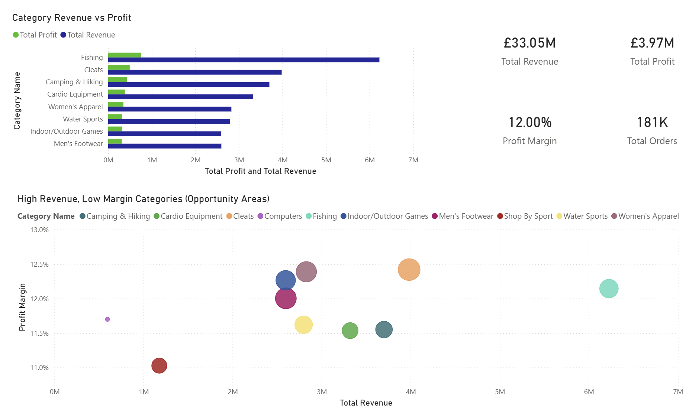
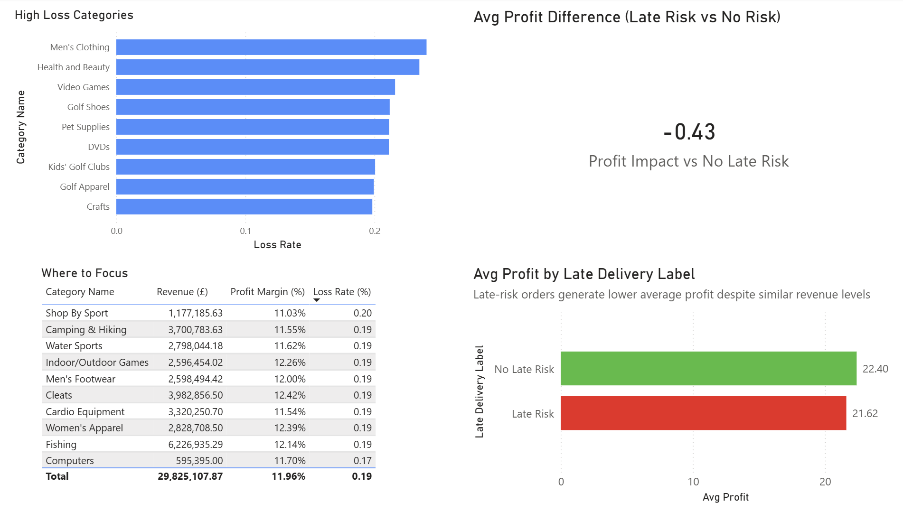

# E-Commerce Supply Chain Profitability Audit

This project analyses supply chain and transaction data from an e-commerce business to identify key drivers of profitability, operational inefficiencies, and opportunities to improve margins.

The analysis focuses on category-level performance, loss-making behaviour, and the impact of delivery risk on profitability.

The goal is to demonstrate how SQL and Power BI can be used together to generate actionable commercial insights for an e-commerce business.

---

## Dashboard Overview

### Executive Summary

### Operational Deep Dive

---

## Project Highlights

- Analysed over **180,000 orders** from an e-commerce supply chain dataset  
- Identified **£33.05M total revenue** and **£3.97M total profit**  
- Calculated an overall **profit margin of ~12%**  
- Highlighted high-revenue categories operating on relatively low margins  
- Identified categories with **high loss rates (up to ~24%)**  
- Quantified the impact of delivery risk on profitability  
- Built a two-page Power BI dashboard to communicate findings clearly  

---

## Key Insights

### 1. High Revenue, Low Margin Categories

Several of the highest revenue categories operate on relatively low profit margins, including:

- Fishing  
- Cleats  
- Camping & Hiking  
- Cardio Equipment  

These categories generate significant revenue but offer limited margin headroom, indicating potential opportunities for:

- Cost optimisation  
- Pricing adjustments  
- Supplier renegotiation  

---

### 2. High Loss Rate Categories

Certain categories show a high proportion of loss-making orders, including:

- Men's Clothing  
- Health and Beauty  
- Video Games  
- Golf Shoes  

Loss rates in these categories exceed 20%, suggesting issues such as:

- Discounting strategy  
- Returns or cancellations  
- Inefficient cost structures  

These areas require further investigation to reduce profit leakage.

---

### 3. Delivery Risk Impacts Profitability

Orders flagged as **late delivery risk** generate lower average profit:

- No Late Risk: ~£22.40 average profit  
- Late Risk: ~£21.62 average profit  

This represents a reduction of approximately **£0.43 per order**.

While the difference per order is small, the high volume of at-risk orders means the cumulative impact on profitability is significant.

---

### 4. Operational Efficiency Opportunity

Late delivery risk is strongly associated with:

- Lower average profit  
- High order volumes  

This suggests that improving delivery performance could:

- Increase profit per order  
- Reduce operational inefficiencies  
- Improve customer experience  

---

### 5. Priority Focus Areas

Combining revenue, margin, and loss rate highlights key categories for action:

- Shop By Sport  
- Men's Footwear  
- Indoor/Outdoor Games  
- Camping & Hiking  

These categories combine:

- High revenue  
- Low to moderate margins  
- Elevated loss rates  

Making them strong candidates for targeted optimisation.

---

## SQL Analysis

The analysis was performed using SQL to aggregate and explore the dataset, including:

- Total revenue and profit calculation  
- Category-level revenue and profitability  
- Profit margin analysis  
- Loss rate calculation by category  
- Delivery performance and profitability analysis  
- Late delivery risk impact assessment  

Key queries are included in the repository.

---

## Power BI Dashboard

A two-page dashboard was built to present findings:

### Page 1 – Executive Summary
- Business overview (revenue, profit, margin, orders)  
- Category performance (revenue vs profit)  
- Identification of high revenue, low margin opportunities  

### Page 2 – Operational Deep Dive
- High loss rate categories  
- Delivery risk impact on profitability  
- Priority categories for action  

The dashboard is designed to support decision-making at both strategic and operational levels.

---

## Tools Used

- SQL (SQLite)  
- Power BI  
- Excel (data handling)  

---

## Dataset

This project uses the DataCo Smart Supply Chain dataset.

Source: Kaggle – DataCo Smart Supply Chain dataset  

The dataset is not included in this repository.

---

## Conclusion

This analysis demonstrates how supply chain inefficiencies and delivery performance can materially impact profitability in an e-commerce business.

Key opportunities identified include:

- Improving delivery reliability  
- Reducing loss-making orders  
- Optimising high-revenue, low-margin categories  

By addressing these areas, the business could increase profitability without necessarily increasing revenue.

---
